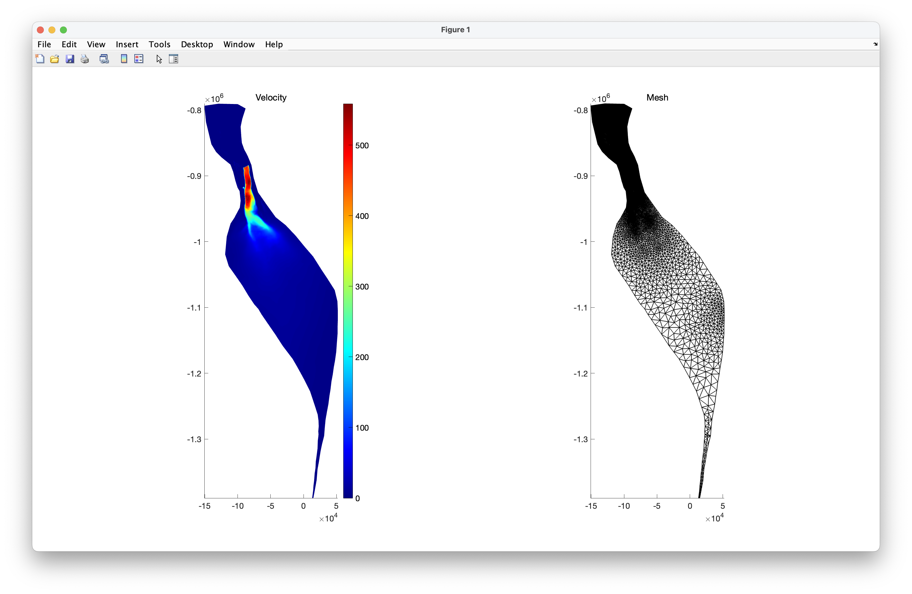
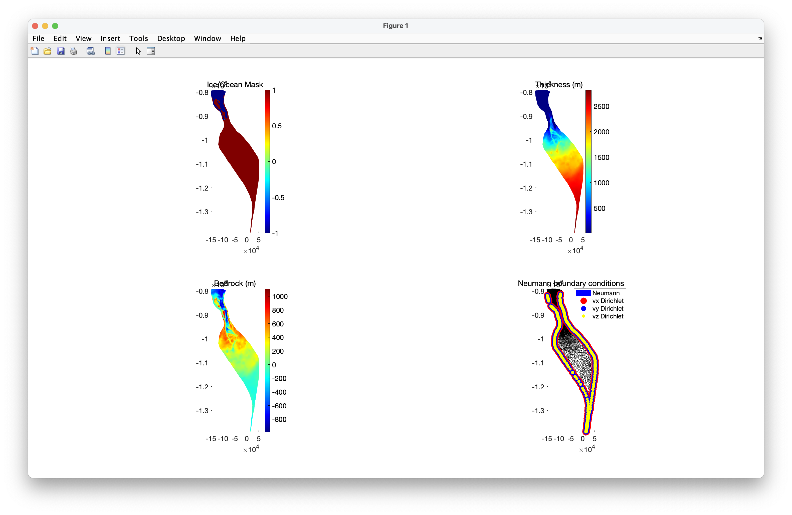
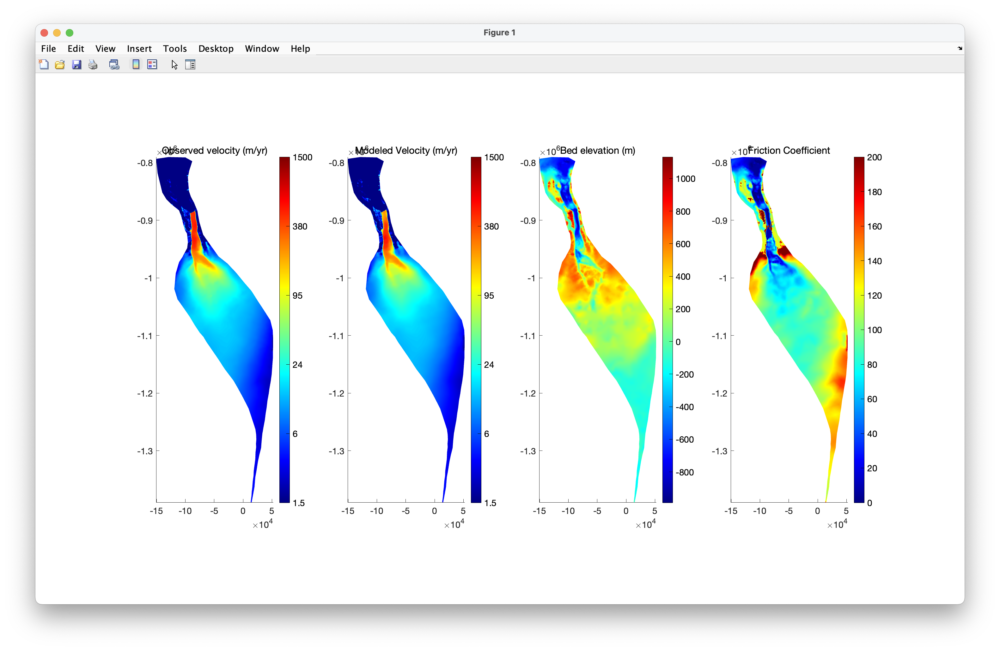
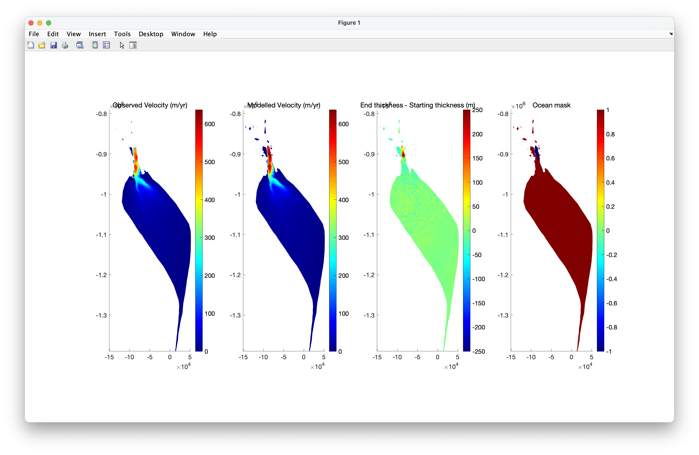

# t-ISSM: Glacier fun with J-man and Felis 
Email jamie.barnett@geo.su.se and felicity.holmes@geo.su.se if you have questions

Before doing this exercise, you will need to get the relevant ISSM binaries from [here](https://issm.jpl.nasa.gov/download/binaries/), and download all the necessary data for running the simulations from [here](https://stockholmuniversity.app.box.com/folder/245521938798?s=hlupsyfabz5gnro0n8gjehwz66ws6mus).

# Task 1: Choose your pokemon (glacier)

- For this exercise, each group will choose one of the following glaciers to model:
  - 79 North glacier (Nioghalvfjerdsbrae)
  - Helheim glacier
  - Kangerlussuaq glacier
  - Petermann glacier
  - Jakobshavn Isbrae
  - Tracy and Heilprin glaciers
 
- Each group should choose a different glacier - this will be decided in class 
- Ryder glacier is only used for the in-class example, and is shown in all the example figures in these instructions

# Task 2: Run model to spun-up state 

- Open up matlab, and navigate to the t-issm directory and open the 'runme.m' file - this is where you will work from for this exercise
- Make sure all the ISSM source code AND the t-issm directory is on your Matlab PATH

## Step 1: Mesh it

- Meshing the glacier is 'Step 1' in the runme script - to run this step, you should make sure the first line of the script looks like this:

`steps = [1];`

- Once this is set, you can run the script by either pressing the large 'Run' button at the top of the screen, or by executing 'runme' in the command window

- In this step, we create a mesh from the outline provided in the accompanying shapefiles
- The minimum and maximum mesh resolutions are pre-set for each glacier, so you do not need to change these
- We use present day observed surface velocities to determine where the maximum mesh resolution is applied - with a higher mesh resolution being used in areas with faster flow

- Upon successful completion of this step, you should get output that looks similar to the example below:

## Step 2: Parameterise it

- Set `steps = [2];`
- In the parameterisation step, we use various observational datasets to set the **initial conditions** and **boundary conditions** for the glacier
- All of these datasets are read in and applied to the glacier using the `Greenland.par` file
- Upon successful completion of this step, you should get output that looks similar to the example below:

  

## Step 3: Invert it/ run the stress balance

- Set `steps = [3];`
- The next step is to use observed surface velocities to invert for basal friction, whilst also solving for a Stressbalance solution of the glacier
- Upon successful completion of this step, you should get output that looks similar to the example below:

 

## Step 4: Spin it up

- In the spin-up stage, we try to set parameters such as those relating to calving and frontal melt at values which lead to a stable glacier
- This stable position is then our starting point for any future transient simulations
- Spinning up a glacier is useful as it means that the way your glacier behaves in the model once you implement your forcings can be likely attributed to said forcings rather than to model drift
- The spin-up parameters for each glacier have been set for you, and these sounds give acceptable spun-up glaciers
- If this was to be a 'real' study, you would probably spend a lot more time on the spin-up and could no doubt find a set of parameters that yield an even better spun-up state

- At the end of this step, you should see something like the following:

 

# Task 3: Design and run some transient simulations

- For the transient simulations, you need to decide as a group what you want to investigate
- Examples of questions you could answer are things like:
  - What are the differences in glacier behaviour up to 2050 under a low vs high emissions future scenario?
  - Is the glacier more sensitive to changes in ocean thermal forcing or to changes in SMB?
  - Under which climate scenarios does the glacier lose its floating ice tongue?
 
- You need to think about which forcings you can change, and look at the datasets available
- Some things you can change are:
    - SMB (e.g. different SSPs)
    - Basal melt under ice tongues
    - Frontal melt along grounded termini
    - Calving stress thresholds for floating and grounded ice
  
- It is a good idea to do a bit of reading about your chosen glacier to understand which type of question might be relevant and/or interesting
- You also need to consider how many simulations you need to run to answer your research question

- Once you have decided on the question(s) to investigate, you need to change the relevant parameters in the header section of the `runme` script

- Make sure to keep good notation about which simulations you run 

# Task 4: Analyse your results

Once you have run your simulations, it is time to analyse your results. Try to make comparisons between our different simulations and use a variety of different types of plots/graphs. 

There are several scripts included in t-ISSM, detailed below, that you can use to help you analyse your results:

1) `plot_outlines` - This creates a plot showing velocities and glacier geometry along a 2D flowline for every output step in your simulation. Usage is as follows: `plot_outlines(md,'EXPFILE')`, where the second argument is the path to the .exp file detailing your flowline.
2) `plot_output` - This creates a series of line plots showing how several variables evolve with time during your simulation. Usage is as follows: `plot_output` (no input variables required, but assumes a model named 'md' is loaded into the workspace).
3) `export_csv` - This allows you to export results to a .csv file, for further analysis/ plotting in a program of your choice. Usage is as follows: `export_csv(md,'flowline')`. 

You can also make plots directly in matlab, for example via using the `plotmodel()` command. Examples of this command being used can be seen at the end of most Steps in the `runme` file.

A helpful resource for plotting tips is the ISSM website [here](https://issm.jpl.nasa.gov/documentation/plotmatlab/). 

# Task 5: Make a presentation

- Each group should make a c. 20-25 minute presentation about their modelling project
- Every group member should take part in the oral presentation
- Include the following in your presentations:
    - Background on your glacier
    - Scientific questions
    - Model set-up and experimental design; how did your set up your model to address your chosen question(s)?
      - Also include information on forcings here (e.g. SMB, melt rates)
    - Results
    - Conclusions and what you would do next if you had more time

- We will then have 5-10 minutes of questions after each presentation
 
